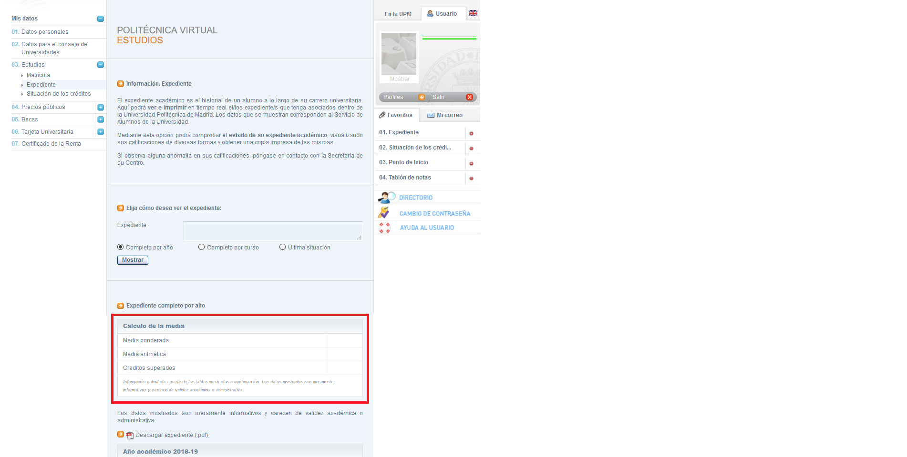

# Calculadora Nota Media

Esta extensión permite calcular de una forma sencilla y rápida la nota media
a partir de la información mostrada en el Expediente en la página de Politécnica
Virtual de la Universidad Politécnica de Madrid.

1. Entrar en la página de la Politécnica Virtual.
2. Dirigirse al menú 'Mis Datos' > 'Estudios' > 'Expediente'.
3. Seleccionar el expediente que se quiere mostrar.
4. Seleccionar como se desea ver el expediente (por curso, por año...)
5. Calcular la media o mostrar estadísticas.

El estilo de la página sigue las normas de Material Design y los iconos han sido
extraídos de la [página oficial](https://material.io/resources/icons/?style=baseline).
